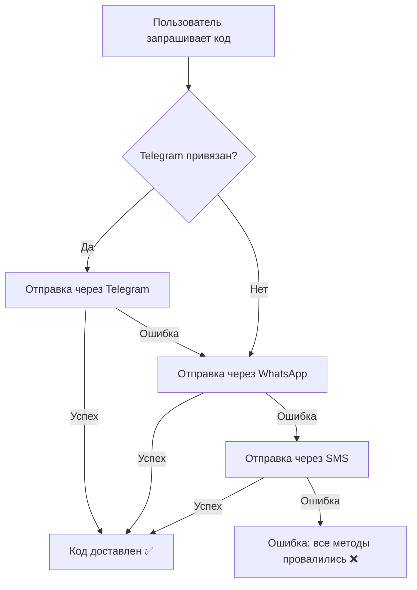

# 🔐 Полное руководство по 2FA аутентификации

## 🎉 Обзор системы

**МойСоюз** использует современную систему двухфакторной аутентификации через мессенджеры и SMS.

### ✨ Особенности:

- ✅ **Без паролей** - только PIN-коды
- ✅ **3 канала доставки** - Telegram, WhatsApp, SMS
- ✅ **Автоматический fallback** - если один канал не работает, пробуется следующий
- ✅ **Умная маршрутизация** - система выбирает оптимальный канал
- ✅ **Экономия** - приоритет бесплатным каналам (Telegram)

---

## 📊 Приоритеты доставки



---

## 🚀 Быстрый старт

### 1️⃣ Переменные окружения

Добавьте в `.env.local`:

```env
# Telegram Bot
TELEGRAM_BOT_TOKEN=YOUR_TELEGRAM_BOT_TOKEN
TELEGRAM_BOT_USERNAME=myunionpro_bot

# SendPulse
SENDPULSE_USER_ID=YOUR_SENDPULSE_USER_ID
SENDPULSE_SECRET=YOUR_SENDPULSE_SECRET
```

### 2️⃣ Миграция БД

```bash
pnpm prisma db push
```

Добавлены поля:
- `User.telegramChatId` - для привязки Telegram
- `User.telegramUsername` - для справки

### 3️⃣ Настройка Telegram Webhook (после деплоя)

```bash
# ⚠️ ВАЖНО: Замените YOUR_TELEGRAM_BOT_TOKEN на реальный токен из переменных окружения
curl -X POST "https://api.telegram.org/bot${TELEGRAM_BOT_TOKEN}/setWebhook" \
  -d "url=https://myunion.pro/api/telegram/webhook"
```

### 4️⃣ Настройка SendPulse

1. **WhatsApp Business** - верификация 1-2 дня (опционально)
2. **SMS баланс** - пополните минимум 500 руб (для fallback)

---

## 📱 Каналы доставки

### 1. Telegram (Приоритет 1) 📱

**Преимущества:**
- ✅ Полностью бесплатно
- ✅ Мгновенная доставка
- ✅ Высокая надежность
- ✅ Популярен в России

**Настройка:**
- См. `TELEGRAM_AUTH_SETUP.md`

**Стоимость:** **0 руб** (бесплатно, без лимитов)

---

### 2. WhatsApp (Приоритет 2) 💬

**Преимущества:**
- ✅ 1000 бесплатных сообщений/месяц
- ✅ Популярен в России и мире
- ✅ Высокая конверсия

**Недостатки:**
- ⚠️ Нужна верификация Facebook Business (1-2 дня)
- ⚠️ После 1000 сообщений - платно

**Настройка:**
- См. `SENDPULSE_SETUP.md`

**Стоимость:**
- Первые 1000 сообщений/месяц: **0 руб**
- Далее: **~0.5-2 руб** за сообщение

---

### 3. SMS (Приоритет 3) 📨

**Преимущества:**
- ✅ Работает везде (даже без интернета)
- ✅ Не нужна установка приложений
- ✅ Высокая доставляемость

**Недостатки:**
- ⚠️ Самый дорогой канал
- ⚠️ Может быть задержка доставки

**Настройка:**
- См. `SENDPULSE_SETUP.md`

**Стоимость:** **~3-5 руб** за SMS

---

## 💰 Расчет стоимости

### Пример для 1000 пользователей/месяц:

#### Сценарий 1: С Telegram
- 70% через Telegram: 700 × **0 руб** = **0 руб**
- 20% через WhatsApp: 200 × **0 руб** = **0 руб** (в лимите)
- 10% через SMS: 100 × **4 руб** = **400 руб**
- **Итого: ~400 руб/месяц**

#### Сценарий 2: Без Telegram
- 70% через WhatsApp: 700 × **0 руб** = **0 руб** (в лимите)
- 30% через SMS: 300 × **4 руб** = **1200 руб**
- **Итого: ~1200 руб/месяц**

#### Сценарий 3: Только SMS (без мессенджеров)
- 100% через SMS: 1000 × **4 руб** = **4000 руб**
- **Итого: ~4000 руб/месяц**

### 💡 Вывод: 

Telegram позволяет **сэкономить до 90%** на доставке кодов!

---

## 🎯 Процесс входа для пользователя

### Вариант 1: С привязанным Telegram

1. Пользователь вводит номер на `/login`
2. Нажимает "Получить код"
3. **Мгновенно** получает код в Telegram 📱
4. Вводит код на сайте
5. Вход выполнен! ✅

**Время:** ~10 секунд

---

### Вариант 2: Без привязанного Telegram (первый вход)

1. Пользователь вводит номер на `/login`
2. Нажимает "Получить код"
3. Получает код через WhatsApp 💬 или SMS 📨
4. Вводит код на сайте
5. Вход выполнен! ✅
6. **Опционально:** Привязывает Telegram для следующих входов

**Время:** ~30-60 секунд (зависит от оператора)

---

### Вариант 3: Привязка Telegram

1. При первом входе показывается подсказка
2. Пользователь нажимает "Привязать Telegram"
3. Открывается бот `@myunionpro_bot`
4. Нажимает `/start`
5. Telegram привязан! ✅
6. Следующий вход будет **мгновенным**

**Время привязки:** ~20 секунд

---

## 📝 API Endpoints

### `POST /api/auth/sms/send-pin`

Отправляет PIN-код на номер телефона

**Request:**
```json
{
  "phone": "+79991234567"
}
```

**Response:**
```json
{
  "success": true,
  "deliveryMethod": "telegram",
  "message": "Код подтверждения отправлен в Telegram 📱"
}
```

---

### `POST /api/auth/sms/verify-pin`

Проверяет PIN-код и авторизует пользователя

**Request:**
```json
{
  "phone": "+79991234567",
  "pinCode": "1234"
}
```

**Response:**
```json
{
  "success": true,
  "user": {
    "id": "...",
    "phone": "+79991234567",
    "firstName": "Иван",
    "lastName": "Иванов"
  }
}
```

---

### `POST /api/telegram/link`

Генерирует deep link для привязки Telegram

**Request:**
```json
{
  "phone": "+79991234567"
}
```

**Response:**
```json
{
  "success": true,
  "deepLink": "https://t.me/myunionpro_bot?start=AUTH_phone_+79991234567",
  "botUsername": "myunionpro_bot"
}
```

---

### `GET /api/telegram/link/status?phone=+79991234567`

Проверяет статус привязки Telegram

**Response:**
```json
{
  "linked": true,
  "telegramUsername": "username"
}
```

---

## 🔧 Troubleshooting

### 1. PIN-код не приходит

**Проверьте:**
1. Логи сервера: `[2FA Auth]`
2. Баланс SendPulse (для SMS)
3. Статус WhatsApp Business
4. Webhook Telegram настроен правильно

**Решение:**
```bash
# Проверка логов
docker logs -f myunion-app | grep "2FA Auth"

# Проверка Telegram webhook
# ⚠️ ВАЖНО: Замените YOUR_TELEGRAM_BOT_TOKEN на реальный токен из переменных окружения
curl "https://api.telegram.org/bot${TELEGRAM_BOT_TOKEN}/getWebhookInfo"

# Проверка SendPulse токена
# ⚠️ ВАЖНО: Замените YOUR_SENDPULSE_USER_ID и YOUR_SENDPULSE_SECRET на реальные значения из переменных окружения
curl -X POST "https://api.sendpulse.com/oauth/access_token" \
  -H "Content-Type: application/json" \
  -d "{\"grant_type\":\"client_credentials\",\"client_id\":\"${SENDPULSE_USER_ID}\",\"client_secret\":\"${SENDPULSE_SECRET}\"}"
```

---

### 2. Все методы доставки провалились

**Ошибка в логах:**
```
[2FA Auth] ❌ Все методы доставки провалились: 
{ attempts: ['telegram', 'whatsapp', 'sms'], lastError: '...' }
```

**Причины:**
- Telegram webhook не настроен
- WhatsApp Business не активен
- Недостаточно средств для SMS

**Решение:**
1. Настройте хотя бы один канал
2. Проверьте баланс SendPulse
3. Проверьте переменные окружения

---

### 3. Telegram не работает локально

**Причина:** Webhook не может достучаться до localhost

**Решение:** Используйте ngrok для тестирования

```bash
# Запустите ngrok
ngrok http 3004

# Настройте webhook на ngrok URL
# ⚠️ ВАЖНО: Замените YOUR_TELEGRAM_BOT_TOKEN на реальный токен из переменных окружения
curl -X POST "https://api.telegram.org/bot${TELEGRAM_BOT_TOKEN}/setWebhook" \
  -d "url=https://YOUR_NGROK_URL/api/telegram/webhook"
```

---

## 📊 Мониторинг

### Логи сервера

Все события логируются с префиксом `[2FA Auth]`:

```bash
# Успешная доставка
[2FA Auth] ✅ PIN-код успешно отправлен через Telegram

# Ошибка доставки
[2FA Auth] ❌ Telegram не сработал: Chat ID не найден

# Попытка fallback
[2FA Auth] Попытка отправки через WhatsApp на номер: +79991234567
```

### Метрики для мониторинга:

1. **Успешность доставки по каналам:**
   - Telegram: % успешных отправок
   - WhatsApp: % успешных отправок
   - SMS: % успешных отправок

2. **Стоимость:**
   - Общее количество сообщений
   - Разбивка по каналам
   - Стоимость за месяц

3. **Конверсия:**
   - % пользователей, получивших код
   - % пользователей, успешно вошедших
   - Среднее время от запроса кода до входа

---

## 🚀 Дальнейшее развитие

### Идеи для улучшения:

1. **Умная маршрутизация:**
   - Запоминать предпочтительный канал для каждого пользователя
   - Оптимизировать приоритеты на основе аналитики

2. **Viber интеграция:**
   - Добавить Viber как дополнительный канал
   - Популярен в некоторых регионах

3. **Email fallback:**
   - Последний fallback через email
   - Для пользователей без телефона/мессенджеров

4. **Biometric authentication:**
   - Face ID / Touch ID для постоянных устройств
   - Без PIN-кодов для доверенных устройств

5. **Analytics Dashboard:**
   - Визуализация статистики по каналам
   - Графики стоимости и конверсии
   - Alerts при превышении бюджета

---

## 📚 Дополнительная документация

- **Telegram Bot:** `TELEGRAM_AUTH_SETUP.md`
- **SendPulse:** `SENDPULSE_SETUP.md`
- **API Reference:** См. выше в этом документе

---

## ✅ Production Checklist

### Перед деплоем:

- [x] Переменные окружения настроены
- [x] Миграция БД применена
- [ ] Telegram webhook настроен на прод URL
- [ ] WhatsApp Business верифицирован (опционально)
- [ ] SMS баланс пополнен (минимум 500 руб)
- [ ] Протестирован полный процесс входа
- [ ] Настроен мониторинг логов
- [ ] Проверены все три канала доставки

### После деплоя:

- [ ] Проверить webhook: `getWebhookInfo`
- [ ] Отправить тестовый код
- [ ] Проверить логи на ошибки
- [ ] Настроить alerts в SendPulse
- [ ] Мониторить первые 100 входов

---

## 🎉 Итоги

**Текущая версия:** v1.5.0

**Что реализовано:**
- ✅ Telegram Bot для 2FA
- ✅ SendPulse для WhatsApp и SMS
- ✅ Умная система fallback
- ✅ Экономия до 90% на доставке
- ✅ Полная документация

**Следующие шаги:**
1. Деплой на продакшен
2. Настройка webhook Telegram
3. Верификация WhatsApp Business (опционально)
4. Пополнение баланса для SMS
5. Мониторинг и оптимизация

---

**Вопросы?** Читайте детальные инструкции:
- `TELEGRAM_AUTH_SETUP.md`
- `SENDPULSE_SETUP.md`

