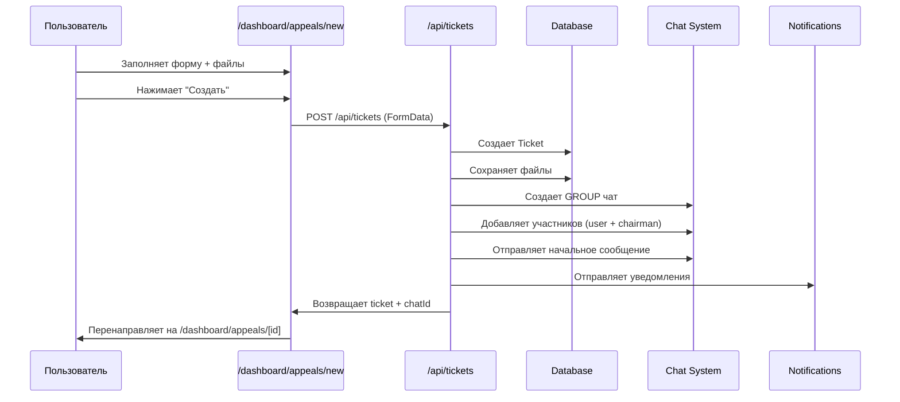
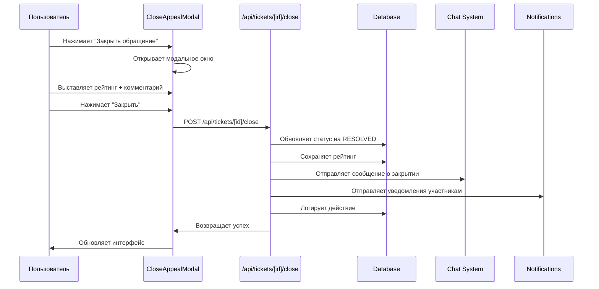

# Модуль обращений (Appeals/Tickets System)

## Обзор

Модуль обращений (Tickets/Appeals) — это система для создания, управления и отслеживания обращений членов профсоюза к председателям организаций. Система интегрирована с чатами для обеспечения коммуникации между обратившимся и председателем.

## Основные возможности

- ✅ Создание обращений с прикреплением файлов и фото
- ✅ AI-помощь при создании обращений (Open Router)
- ✅ Автоматическое создание группового чата с тредами (Slack-стиль)
- ✅ Управление статусами обращений
- ✅ Рейтинг полезности ответов
- ✅ Уведомления участникам
- ✅ Журнал действий (аудит)
- ✅ Фильтрация по статусам, типам, приоритетам
- ✅ Ролевой доступ (член профсоюза / председатель)

---

## Модель данных

### Ticket (Обращение)

```prisma
model Ticket {
  id              String   @id @default(cuid())
  publicId        String   @unique @db.Char(8)  // 8-значный публичный ID (10000000-99999999)
  
  // Связи
  userId          String
  user            User     @relation("UserTickets")
  organizationId  String?
  organization    Organization?
  chatId          String?  @unique  // Связь с чатом
  chat            Chat?    @relation("TicketChat")
  
  // Основная информация
  type            TicketType      // LEGAL, ACCOUNTING, TECHNICAL, HR, OTHER
  status          TicketStatus    // PENDING, IN_PROGRESS, RESOLVED, REJECTED, CLOSED
  priority        TicketPriority  // LOW, MEDIUM, HIGH, URGENT
  title           String
  content         String          @db.Text  // HTML контент
  
  // Файлы и комментарии
  attachments     TicketAttachment[]
  comments        TicketComment[]
  actionLogs      TicketActionLog[]
  
  // Метаданные
  tags            String?         // JSON массив тегов
  resolved        Boolean          @default(false)
  resolvedAt      DateTime?
  
  // Отклонение
  rejectionReason String?          @db.Text
  
  // Рейтинг
  helpfulRating        Int?
  helpfulRatingComment String?     @db.Text
  helpfulRatingAt      DateTime?
  
  createdAt       DateTime         @default(now())
  updatedAt       DateTime         @updatedAt
}
```

### Типы обращений (TicketType)

- `LEGAL` — Юридическое обращение
- `ACCOUNTING` — Бухгалтерское обращение
- `TECHNICAL` — Техническая поддержка
- `HR` — Кадровые вопросы
- `OTHER` — Прочее

### Статусы обращений (TicketStatus)

- `PENDING` — Ожидание (новое обращение)
- `IN_PROGRESS` — В работе (председатель начал работу)
- `RESOLVED` — Решено (председатель решил вопрос)
- `REJECTED` — Отклонено (с указанием причины)
- `CLOSED` — Закрыто (закрыто пользователем после решения)

### Приоритеты (TicketPriority)

- `LOW` — Низкая
- `MEDIUM` — Средняя
- `HIGH` — Высокая
- `URGENT` — Срочная

### TicketAttachment (Вложения)

```prisma
model TicketAttachment {
  id        String   @id @default(cuid())
  ticketId  String
  ticket    Ticket   @relation(fields: [ticketId], references: [id], onDelete: Cascade)
  
  fileName  String
  filePath  String   // Путь к файлу в /public/uploads/tickets
  fileSize  Int      // Размер в байтах
  mimeType  String
  
  createdAt DateTime @default(now())
}
```

### TicketActionLog (Журнал действий)

```prisma
model TicketActionLog {
  id          String   @id @default(cuid())
  ticketId    String
  ticket      Ticket   @relation(fields: [ticketId], references: [id], onDelete: Cascade)
  
  userId      String
  user        User     @relation("UserTicketActions")
  
  actionType  String   // created, updated, replied, rejected, approved, deleted, closed, rated
  description String   @db.Text
  oldValue    String?  @db.Text
  newValue    String?  @db.Text
  metadata    Json?
  
  createdAt   DateTime @default(now())
}
```

---

## API Endpoints

### GET /api/tickets

Получить список обращений текущего пользователя.

**Параметры запроса:**
- `status` (optional) — фильтр по статусу (`all`, `PENDING`, `IN_PROGRESS`, `RESOLVED`, `REJECTED`, `CLOSED`)

**Логика доступа:**
- **Обычный пользователь** видит:
  - Свои обращения (`userId = session.user.id`)
  - Обращения из чатов, где он участник
  - Обращения из своей организации (`organizationId`)
  - Свои старые обращения без `organizationId`
  
- **Председатель (PPO_HEAD)** видит:
  - Все обращения из своей организации (`organizationId = chairman.organizationId`)
  - Обращения из чатов, где он участник (для старых обращений)

**Ответ:**
```json
{
  "tickets": [
    {
      "id": "cmkpdy036000aptwj7qwjpzvp",
      "publicId": "1489-8352",
      "type": "LEGAL",
      "status": "PENDING",
      "priority": "MEDIUM",
      "title": "Не могу подключить макс",
      "content": "<p>Текст обращения...</p>",
      "createdAt": "2025-01-20T10:00:00Z",
      "updatedAt": "2025-01-20T10:00:00Z",
      "attachmentsCount": 2,
      "commentsCount": 0,
      "chatId": "cmkpdy02z0005ptwjrxqo7x8o",
      "createdBy": {
        "id": "user123",
        "firstName": "Иван",
        "lastName": "Иванов"
      },
      "isOwner": true
    }
  ]
}
```

### POST /api/tickets

Создать новое обращение.

**Тело запроса (FormData):**
- `type` (required) — тип обращения
- `priority` (required) — приоритет
- `title` (required) — заголовок
- `content` (required) — HTML контент
- `files[]` (optional) — массив файлов

**Ограничения файлов:**
- Максимальный размер: 10 MB
- Запрещенные расширения: `.exe`, `.bat`, `.cmd`, `.com`, `.scr`, `.vbs`, `.js`, `.jar`, `.sh`
- Разрешены: изображения, документы (PDF, DOC, DOCX, XLS, XLSX), архивы

**Процесс создания:**
1. Генерация 8-значного `publicId` (10000000-99999999)
2. Сохранение файлов в `/public/uploads/tickets` и `/public/uploads/chat`
3. Создание группового чата (GROUP) с участниками:
   - Обратившийся (роль: `member`)
   - Председатель организации (роль: `admin`)
4. Отправка начального сообщения в чат с текстом обращения и вложениями
5. Отправка уведомлений участникам чата (кроме создателя)
6. Сохранение обращения в базу знаний (если включено)

**Ответ:**
```json
{
  "success": true,
  "ticket": {
    "id": "cmkpdy036000aptwj7qwjpzvp",
    "publicId": "1489-8352",
    "chatId": "cmkpdy02z0005ptwjrxqo7x8o"
  }
}
```

### GET /api/tickets/[id]

Получить обращение по ID.

**Проверка доступа:**
- Владелец обращения (`ticket.userId === session.user.id`)
- Председатель организации (`PPO_HEAD` и `ticket.organizationId === user.organizationId`)
- Участник чата обращения (`chat.participants.includes(session.user.id)`)

**Ответ:**
```json
{
  "success": true,
  "ticket": {
    "id": "cmkpdy036000aptwj7qwjpzvp",
    "publicId": "1489-8352",
    "type": "LEGAL",
    "status": "PENDING",
    "priority": "MEDIUM",
    "title": "Не могу подключить макс",
    "content": "<p>Текст обращения...</p>",
    "attachments": [...],
    "chatId": "cmkpdy02z0005ptwjrxqo7x8o",
    "userId": "user123",
    "organizationId": "org123",
    "rejectionReason": null,
    "helpfulRating": null,
    "helpfulRatingComment": null,
    "helpfulRatingAt": null
  }
}
```

### PUT /api/tickets/[id]

Обновить обращение (только владелец, только статус `PENDING`).

**Тело запроса:**
```json
{
  "title": "Обновленный заголовок",
  "content": "<p>Обновленный контент...</p>"
}
```

**Действия:**
- Обновление `title` и `content`
- Логирование действия в `TicketActionLog`
- Отправка сообщения в чат: "📝 Обращение отредактировано"

### DELETE /api/tickets/[id]

Удалить обращение (только владелец, только статусы `PENDING` или `REJECTED`).

**Действия:**
- Логирование действия
- Удаление связанного чата (все участники помечаются как покинувшие, чат удаляется)
- Каскадное удаление вложений и комментариев

### POST /api/tickets/[id]/close

Закрыть обращение с рейтингом (только владелец).

**Тело запроса:**
```json
{
  "rating": 5,  // 1-5
  "comment": "Спасибо за помощь!"  // optional
}
```

**Действия:**
- Обновление статуса на `RESOLVED`
- Сохранение рейтинга и комментария
- Отправка сообщения в чат с информацией о закрытии
- Отправка уведомлений всем участникам чата (кроме создателя)
- Логирование действия

### POST /api/tickets/[id]/rate

Оценить полезность ответа (только владелец, только статусы `RESOLVED` или `CLOSED`).

**Тело запроса:**
```json
{
  "rating": 5,  // 1-5 (required)
  "comment": "Очень помогли!"  // optional
}
```

**Действия:**
- Сохранение рейтинга (можно оценить только один раз)
- Отправка сообщения в чат с оценкой
- Уведомление председателя об оценке
- Логирование действия

### GET /api/ppo-head/appeals

Получить список обращений для председателя.

**Параметры запроса:**
- `status` (optional) — фильтр по статусу

**Логика:**
- Показывает обращения из организации председателя (`organizationId`)
- Показывает обращения из чатов председателя (для старых обращений без `organizationId`)

---

## UI Компоненты

### Страницы

#### `/dashboard/appeals` — Список обращений

**Компонент:** `app/dashboard/appeals/page.tsx`

**Функционал:**
- Отображение списка обращений с фильтрацией по статусу
- Переход к детальной странице обращения
- Переход к чату обращения
- Разные представления для обычных пользователей и председателей

**Для обычных пользователей:**
- Показывает только свои обращения
- Кнопка "Создать обращение"

**Для председателей:**
- Показывает все обращения из организации
- Переход на страницу `/dashboard/appeals/ppo-head`

#### `/dashboard/appeals/new` — Создание обращения

**Компонент:** `app/dashboard/appeals/new/page.tsx`

**Функционал:**
- Форма создания обращения:
  - Тип обращения (select)
  - Приоритет (select)
  - Заголовок (input)
  - Описание (Rich Text Editor)
  - Прикрепление файлов и фото
  - Кнопка "Помощь ИИ" (улучшение текста через Open Router)
- Валидация полей
- Предпросмотр изображений
- Ограничения на размер и тип файлов

**AI-помощь:**
- Вызывает `/api/ai/improve-text`
- Улучшает текст обращения с помощью GPT-4o-mini
- Заменяет текст в редакторе

#### `/dashboard/appeals/[id]` — Детальная страница обращения

**Компонент:** `app/dashboard/appeals/[id]/page.tsx`

**Функционал:**
- Отображение полной информации об обращении
- Просмотр вложений
- Просмотр комментариев
- Кнопка "Открыть чат" (если есть `chatId`)
- Кнопка "Закрыть обращение" (только для владельца, если статус не `CLOSED`/`RESOLVED`)

#### `/dashboard/appeals/ppo-head` — Страница председателя

**Компонент:** `app/dashboard/appeals/ppo-head/page.tsx`

**Функционал:**
- Список всех обращений из организации
- Фильтрация по статусу
- Детальный просмотр обращения
- Управление статусами (для председателя)

### Компоненты

#### `CloseAppealModal`

**Компонент:** `components/appeals/CloseAppealModal.tsx`

**Функционал:**
- Модальное окно для закрытия обращения
- Форма с рейтингом (1-5 звезд) и комментарием
- Валидация и отправка на `/api/tickets/[id]/close`

---

## Процессы

### 1. Создание обращения



**Детали:**
1. Пользователь заполняет форму на `/dashboard/appeals/new`
2. При необходимости использует AI-помощь для улучшения текста
3. Прикрепляет файлы (до 10 MB, запрещены опасные расширения)
4. Отправляет форму на `POST /api/tickets`
5. API генерирует 8-значный `publicId` (например, `14898352`)
6. Сохраняет файлы в `/public/uploads/tickets` и `/public/uploads/chat`
7. Создает групповой чат (тип `GROUP`) с участниками:
   - Обратившийся (роль `member`)
   - Председатель организации (роль `admin`)
8. Отправляет начальное сообщение в чат с текстом обращения и вложениями
9. Отправляет push/email уведомления участникам (кроме создателя)
10. Возвращает созданное обращение с `chatId`

### 2. Закрытие обращения



**Детали:**
1. Пользователь открывает детальную страницу обращения
2. Нажимает кнопку "Закрыть обращение" (видна только владельцу, если статус не `CLOSED`/`RESOLVED`)
3. Открывается модальное окно `CloseAppealModal`
4. Пользователь выставляет рейтинг (1-5) и опциональный комментарий
5. Отправляется запрос на `POST /api/tickets/[id]/close`
6. API обновляет статус на `RESOLVED`, сохраняет рейтинг
7. Отправляется сообщение в чат: "Обращение закрыто пользователем {имя}. Оценка: ⭐⭐⭐⭐⭐ (5/5)"
8. Отправляются уведомления всем участникам чата (кроме создателя)
9. Действие логируется в `TicketActionLog`

### 3. Оценка полезности ответа

**Процесс:**
1. После закрытия обращения пользователь может оценить полезность ответа
2. Вызывается `POST /api/tickets/[id]/rate` с рейтингом (1-5) и комментарием
3. Оценка сохраняется (можно оценить только один раз)
4. Отправляется сообщение в чат с оценкой
5. Председатель получает уведомление об оценке

### 4. Удаление обращения

**Условия:**
- Только владелец обращения
- Только статусы `PENDING` или `REJECTED`

**Процесс:**
1. Пользователь удаляет обращение через `DELETE /api/tickets/[id]`
2. Логируется действие
3. Удаляется связанный чат:
   - Все участники помечаются как покинувшие (`leftAt = now()`)
   - Чат удаляется (каскадно удаляются сообщения)
4. Обращение удаляется (каскадно удаляются вложения и комментарии)

---

## Интеграция с чатами

### Связь обращения и чата

- Каждое обращение может иметь связанный чат (`chatId`)
- При создании обращения автоматически создается групповой чат (тип `GROUP`)
- Участники чата:
  - Обратившийся (роль `member`)
  - Председатель организации (роль `admin`)
- Чат поддерживает треды (Slack-стиль) через `ChatMessage.threadRootId`

### Начальное сообщение

При создании обращения в чат отправляется начальное сообщение:

```
**Обращение #1489-8352**

**Тема:** Не могу подключить макс

**Текст обращения:**
[HTML контент обращения]

**Дата и время создания:** 20.01.2025 в 10:00
```

К сообщению прикрепляются все файлы обращения.

### Сообщения о действиях

- **Редактирование:** "📝 Обращение отредактировано"
- **Закрытие:** "Обращение закрыто пользователем {имя}. Оценка: ⭐⭐⭐⭐⭐ (5/5)"
- **Оценка:** "📊 Оценка полезности ответа: ⭐⭐⭐⭐⭐ (5/5)"

### Удаление чата при удалении обращения

При удалении обращения:
1. Все участники чата помечаются как покинувшие
2. Чат удаляется (каскадно удаляются сообщения)
3. Чат исчезает из списка чатов всех участников

### Фильтрация чатов удаленных обращений

В `lib/chat-service.ts` реализована фильтрация:
- При загрузке чатов проверяется, существует ли связанное обращение
- Если обращение удалено, чат не показывается в списке
- Логика: `chat.ticket === null` → проверка существования обращения в БД → если не найдено, чат пропускается

---

## Роли и права доступа

### Обычный пользователь (MEMBER)

**Может:**
- ✅ Создавать обращения
- ✅ Просматривать свои обращения
- ✅ Редактировать свои обращения (только статус `PENDING`)
- ✅ Удалять свои обращения (только статусы `PENDING`, `REJECTED`)
- ✅ Закрывать свои обращения с рейтингом
- ✅ Оценивать полезность ответов
- ✅ Просматривать обращения из чатов, где он участник
- ✅ Просматривать обращения из своей организации

**Не может:**
- ❌ Просматривать чужие обращения (кроме участника чата)
- ❌ Управлять статусами обращений (кроме закрытия)

### Председатель (PPO_HEAD)

**Может:**
- ✅ Просматривать все обращения из своей организации
- ✅ Просматривать обращения из чатов, где он участник
- ✅ Управлять статусами обращений (через отдельный интерфейс)
- ✅ Отклонять обращения с указанием причины
- ✅ Отвечать в чатах обращений
- ✅ Получать уведомления о новых обращениях
- ✅ Получать уведомления об оценках обращений

**Не может:**
- ❌ Создавать обращения (как председатель, но может как обычный пользователь)
- ❌ Удалять обращения (только владелец может)

---

## Уведомления

### Типы уведомлений

1. **Новое обращение** (`ticket_response`)
   - Получатели: участники чата (кроме создателя)
   - Текст: "Новое обращение: {title}"
   - URL: `/dashboard/chat?chatId={chatId}`

2. **Обращение закрыто** (`ticket_closed`)
   - Получатели: участники чата (кроме создателя)
   - Текст: "{имя} закрыл обращение. Оценка: {rating}/5"
   - URL: `/dashboard/appeals/ppo-head?id={publicId}`

3. **Оценка обращения** (`ticket_rated`)
   - Получатели: председатель организации
   - Текст: "{имя} оценил ответ по обращению #{publicId} на {rating}/5"
   - URL: `/dashboard/appeals/{id}`

### Каналы уведомлений

- **Push-уведомления** (Firebase Cloud Messaging)
- **Email-уведомления** (если включено в настройках пользователя)
- **In-app уведомления** (сохраняются в `UserNotification`)

---

## Журнал действий (Audit Log)

Все действия с обращениями логируются в `TicketActionLog`:

- `created` — создание обращения
- `updated` — редактирование обращения
- `replied` — ответ на обращение
- `rejected` — отклонение обращения
- `approved` — одобрение обращения
- `deleted` — удаление обращения
- `closed` — закрытие обращения
- `rated` — оценка полезности ответа
- `status_changed` — изменение статуса

**Поля лога:**
- `ticketId` — ID обращения
- `userId` — кто выполнил действие
- `actionType` — тип действия
- `description` — описание действия
- `oldValue` — старое значение (JSON)
- `newValue` — новое значение (JSON)
- `metadata` — дополнительные данные (JSON)
- `createdAt` — время действия

---

## Публичный ID обращений

### Формат

- 8-значное число: `10000000` - `99999999`
- При отображении форматируется: `1234-5678`

### Генерация

```typescript
// lib/appeal-id.ts
export function generateAppealPublicId(): string {
  const min = 10000000;
  const max = 99999999;
  const randomId = Math.floor(Math.random() * (max - min + 1)) + min;
  return randomId.toString();
}

export function formatAppealId(id: string): string {
  if (id.length !== 8) return id;
  return `${id.slice(0, 4)}-${id.slice(4)}`;
}
```

### Использование

- `publicId` используется в URL и для отображения пользователям
- При поиске обращения можно использовать как `id`, так и `publicId`
- API endpoints поддерживают оба варианта

---

## AI-помощь при создании обращений

### Интеграция с Open Router

**Endpoint:** `/api/ai/improve-text`

**Процесс:**
1. Пользователь нажимает кнопку "Помощь ИИ" в форме создания обращения
2. Текст обращения отправляется на `/api/ai/improve-text`
3. API использует модель `openai/gpt-4o-mini` для улучшения текста
4. Улучшенный текст возвращается и заменяет исходный в редакторе

**Промпт:**
```
Система: Ты помощник для улучшения текста обращений в профсоюзную организацию.
Пользователь: Улучши следующий текст обращения, сделав его более структурированным и понятным: {text}
```

---

## Файлы и вложения

### Хранение

- **Путь для обращений:** `/public/uploads/tickets/{ticketId}/{fileName}`
- **Путь для чатов:** `/public/uploads/chat/{chatId}/{fileName}`
- Файлы сохраняются в оба места при создании обращения

### Ограничения

- **Максимальный размер:** 10 MB на файл
- **Запрещенные расширения:**
  - `.exe`, `.bat`, `.cmd`, `.com`, `.scr`, `.vbs`, `.js`, `.jar`, `.sh`
- **Разрешенные типы:**
  - Изображения: JPEG, PNG, GIF, WebP
  - Документы: PDF, DOC, DOCX, XLS, XLSX
  - Архивы: ZIP, RAR, 7Z

### Предпросмотр

- Изображения показываются с превью в форме создания
- Используются blob URLs для предпросмотра (освобождаются при размонтировании компонента)

---

## Примеры использования

### Создание обращения

```typescript
// Frontend
const formData = new FormData();
formData.append("type", "LEGAL");
formData.append("priority", "MEDIUM");
formData.append("title", "Не могу подключить макс");
formData.append("content", "<p>Текст обращения...</p>");
files.forEach(file => formData.append("files", file));

const response = await fetch("/api/tickets", {
  method: "POST",
  body: formData,
});

const data = await response.json();
// { success: true, ticket: { id, publicId, chatId } }
```

### Закрытие обращения

```typescript
// Frontend
const response = await fetch(`/api/tickets/${ticketId}/close`, {
  method: "POST",
  headers: { "Content-Type": "application/json" },
  body: JSON.stringify({
    rating: 5,
    comment: "Спасибо за помощь!",
  }),
});
```

### Получение списка обращений

```typescript
// Frontend
const response = await fetch("/api/tickets?status=all");
const data = await response.json();
// { tickets: [...] }
```

---

## Миграции базы данных

### Основные миграции

- `20251113211059_add_appeals_and_analytics` — создание таблиц `Ticket`, `TicketAttachment`, `TicketComment`, `TicketActionLog`
- `20260120000000_add_chat_messages_with_threads` — добавление поддержки тредов в чатах
- `20260121000000_add_channel_chat_type` — добавление типа `CHANNEL` для чатов

---

## Будущие улучшения

- [ ] Поддержка внутренних комментариев (только для председателей)
- [ ] Автоматическое назначение приоритета на основе AI-анализа
- [ ] Интеграция с системой документооборота
- [ ] Экспорт обращений в PDF
- [ ] Статистика и аналитика по обращениям
- [ ] Шаблоны обращений
- [ ] Категоризация по тегам
- [ ] Поиск по содержимому обращений

---

## Связанные документы

- [Chat System Documentation](./CHAT_SYSTEM.md) — документация по системе чатов
- [AI Integration](./AI_PROJECT_DOCUMENTATION.md) — документация по AI-интеграции
- [Notifications System](./NOTIFICATIONS.md) — документация по системе уведомлений

---

## Поддержка

При возникновении проблем:
1. Проверьте логи в консоли браузера и сервера
2. Проверьте журнал действий (`TicketActionLog`) в базе данных
3. Убедитесь, что пользователь имеет необходимые права доступа
4. Проверьте, что связанный чат существует (если `chatId` не null)
